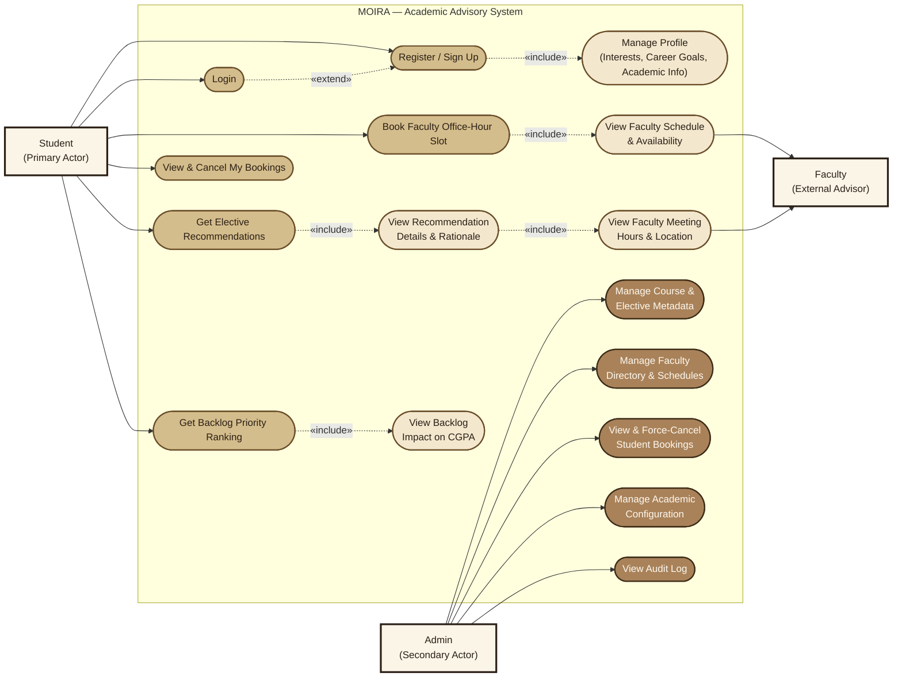
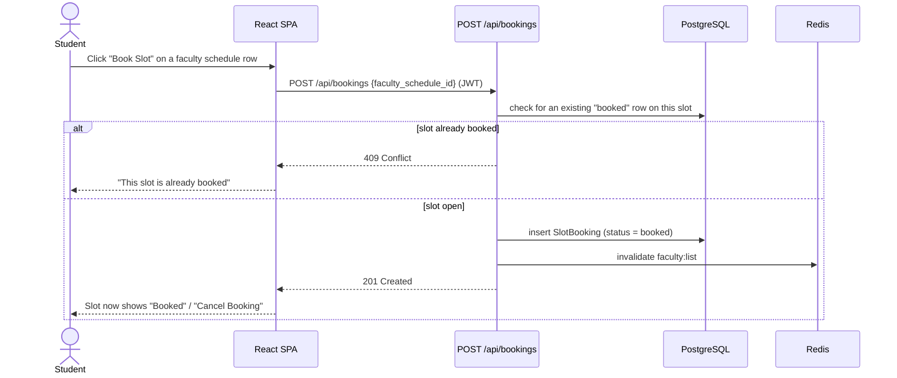
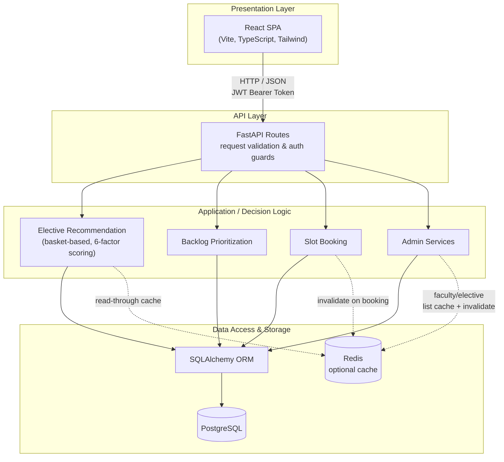
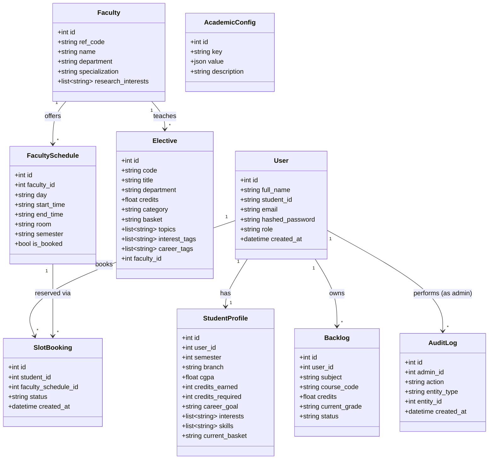
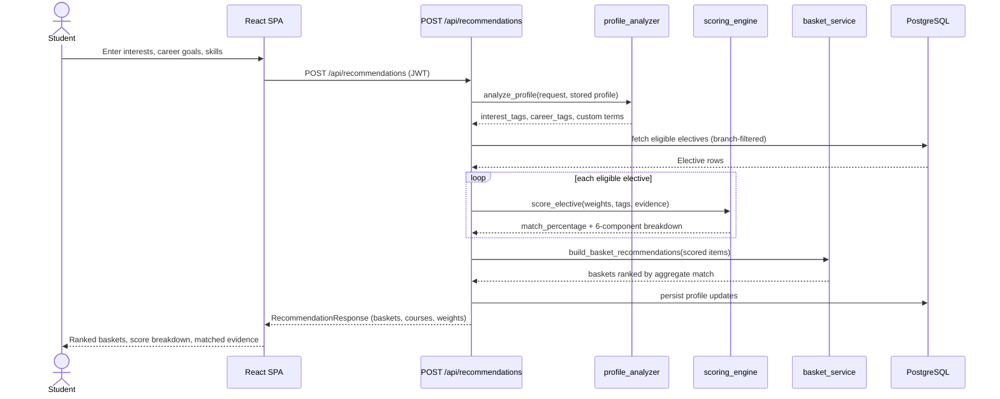

# MOIRA

## Academic Advisory & Decision Support System

> **Every choice draws a path. Find your way forward.**

MOIRA is a web-based academic advisory platform that unifies student profiles, academic data, elective recommendation, backlog analysis, faculty information, and office-hour scheduling into a single decision-support system for undergraduate students.

The system is built around **personalized, explainable, and transparent academic guidance** — every recommendation and every priority ranking traces back to a documented, deterministic formula.

---

## Why MOIRA?

The name **MOIRA** is inspired by the **Moirai (Μοῖραι)** of Greek mythology, traditionally associated with fate and the course of a person's life.

The name reflects the central idea behind the system: **academic choices contribute to the path a student takes forward**.

MOIRA does not make decisions on behalf of students. Instead, it brings together their interests, career goals, academic information, and relevant university data so they can evaluate their options and make informed choices themselves.

---

## Problem Statement

Students routinely make consequential academic decisions using information scattered across course-scheme documents, academic records, faculty directories, and informal peer guidance. Two decisions recur every semester:

- **Elective Selection:** Which elective — and which Elective Focus Basket — best aligns with a student's interests and career direction?
- **Backlog Prioritization:** Which pending backlog should a student clear first, based on its actual impact on CGPA?

MOIRA closes this gap by combining real academic data with dedicated advisory and prioritization engines in a single platform, and lets a student act on a recommendation directly by booking a faculty office-hour slot.

---

# Use Case Diagram

Primary actors and use cases across MOIRA's student, faculty, and admin-facing workflows.

<details open>
<summary><strong>View diagram</strong></summary>



</details>

- **Student (Primary Actor):** registers/logs in, manages their profile, requests elective recommendations, requests backlog priority ranking, and books faculty office-hour slots.
- **Faculty (External Advisor):** consulted for meeting hours, location, and schedule details as part of recommendation and booking workflows.
- **Admin (Secondary Actor):** manages course/elective metadata, faculty directory and schedules, academic configuration, and audit logging — and has full visibility and override authority over student bookings.

---

# What MOIRA Provides

### Student Profile Management
- [x] Semester, branch, and academic standing
- [x] CGPA and completed credits
- [x] Career goals, skills, and completed courses
- [x] Areas of interest, structured and free text
- [x] Persisted server-side, so nothing is re-entered on a later visit

### Elective Advisor
- [x] Recommends at the level of an **Elective Focus Basket (EFB)** — a student commits to one basket and takes all four Elective I–IV courses from within it
- [x] Six-factor, weighted, fully auditable scoring
- [x] Branch-aware filtering and basket-lock enforcement once committed
- [x] Full score breakdown, matched evidence, and prerequisite checklist on every result
- [x] Admin-configurable scoring weights

### Backlog Advisor
- [x] Pending backlog tracking
- [x] CGPA-impact estimation
- [x] Priority classification
- [x] Deterministic, magnitude-based ranking

> **Note:** Backlog calculations are prototype estimates grounded in Thapar's grading ordinance, not official university CGPA calculations.

### Faculty Discovery & Slot Booking
- [x] Searchable faculty directory with specializations and contact information
- [x] Recommendation-based faculty matching
- [x] Slot booking directly from the faculty directory or a recommendation card
- [x] Operates only on real, admin-entered office-hour data — never fabricated availability

Faculty schedule coverage is currently partial (see *Current Limitations*); a small set of clearly-labeled seeded demo slots exists so the feature has something real to demonstrate until each department supplies real office-hour data.

<details open>
<summary><strong>View booking request flow</strong></summary>



</details>

### Authentication & Authorization
- [x] JWT-based signup and login
- [x] Bcrypt password hashing
- [x] Protected API resources
- [x] Role-based authorization (student / admin), re-verified on every request

### Admin
- [x] Role-gated dashboard (electives, faculty, baskets, active bookings, recent activity)
- [x] Full CRUD over electives, faculty, and faculty schedules
- [x] Booking visibility across every student, with a force-cancel override
- [x] Academic configuration (recommendation weights, elective categories)
- [x] Audit logging of every admin mutation

See [`docs/ADMIN.md`](docs/ADMIN.md) and [`docs/BOOKING.md`](docs/BOOKING.md) for the full authorization model and design rationale.

---

# System Architecture

MOIRA is a two-tier web application — a React SPA communicating with a FastAPI JSON API backed by PostgreSQL — containerized with Docker and accelerated by an optional Redis cache.

<details open>
<summary><strong>View diagram</strong></summary>



</details>

| Layer | Responsibility |
|---|---|
| **Presentation** | React/TypeScript pages, components, and session context |
| **API** | FastAPI routes — request validation and auth guards only |
| **Application / Decision Logic** | Elective recommendation, backlog prioritization, booking, admin services |
| **Data Access** | SQLAlchemy ORM models and sessions |
| **Data** | PostgreSQL (source of truth) and Redis (optional, read-path cache) |

Full breakdown, request lifecycle, and the Docker/CI/caching design: [`docs/ARCHITECTURE.md`](docs/ARCHITECTURE.md).

## Data Model

<details open>
<summary><strong>View diagram</strong></summary>



</details>

Full schema, including columns not shown here: [`docs/DATABASE.md`](docs/DATABASE.md)

---

# Decision Engines

## Elective Advisor

MOIRA's Elective Advisor is **deterministic, rule-based, and fully auditable** — the same input and the same academic dataset always reproduce the same result, and every score can be traced back to a documented formula rather than an opaque model. Each course's `match_percentage` is the sum of six independently-computed, weighted components:

| Component | Default Weight | What it measures |
|---|---:|---|
| Interest Alignment | 25% | Overlap between stated interests and the course's tagged interests |
| Career Goal Alignment | 25% | Overlap between stated career goals and the course's career tags |
| Syllabus Alignment | 20% | Real evidence drawn from the course's unit-by-unit syllabus outline |
| Skill Alignment | 15% | Literal skill keywords matched against the course's title/description/syllabus |
| Academic Fit | 10% | Whether the course fits the slot being filled this term, plus overlap with completed coursework |
| Prerequisite Compatibility | 5% | Whether the student has completed what the course's stated prerequisite asks for |

Weights are admin-configurable and must sum to 100 (`PUT /api/admin/config/recommendation_weights`) — retuning changes how much each factor counts, never what is measured or how the score is computed.

Recommendations are grouped and ranked at the **basket level**: a student commits to one Elective Focus Basket and is shown its four member courses together, with the basket's own aggregate match. Results are filtered to the student's own branch plus open/generic electives, and once a basket is committed to, remaining slots are locked to it.

<details open>
<summary><strong>View recommendation request flow</strong></summary>



</details>

Detailed formula: [`docs/RECOMMENDATION_LOGIC.md`](docs/RECOMMENDATION_LOGIC.md)

## Backlog Advisor

Estimates the CGPA impact of clearing each pending backlog by blending an assumed clear-grade — grounded in Thapar's auxiliary-exam grade cap, not an arbitrary guess — into the student's current weighted average, then ranks backlogs by the **magnitude** of that swing, surfacing the most consequential backlog first regardless of direction.

Detailed formula: [`docs/BACKLOG_LOGIC.md`](docs/BACKLOG_LOGIC.md)

---

# Security

- [x] JWT-based authentication with bcrypt password hashing
- [x] Current-user identity re-fetched from the database on every request, never trusted from the token alone
- [x] Admin routes independently re-verify role on every request — a demoted admin loses access on their very next call, not at token expiry
- [x] Secrets (`DATABASE_URL`, `JWT_SECRET`) supplied via environment variables, never committed

---

# API Overview

| Method | Endpoint | Responsibility |
|---|---|---|
| `POST` | `/api/auth/signup` · `/api/auth/login` | Account creation / authentication |
| `GET` / `PUT` | `/api/profile` | Student profile |
| `GET` | `/api/electives` | Browse electives |
| `POST` | `/api/recommendations` | Generate basket-level elective recommendations |
| `GET` / `POST` / `DELETE` | `/api/backlogs` | Manage backlogs |
| `POST` | `/api/backlogs/prioritize` | Generate CGPA-impact priority order |
| `GET` | `/api/faculty` | Search faculty directory |
| `GET` / `POST` / `DELETE` | `/api/bookings` | Book, view, or cancel a faculty office-hour slot |
| `/api/admin/*` | electives · faculty · schedules · bookings · config · audit-log | Full admin CRUD, role-gated |

Complete reference: [`docs/API.md`](docs/API.md)

---

# Tech Stack

| Layer | Technology |
|---|---|
| **Frontend** | React 18, TypeScript, Vite, Tailwind CSS, React Router, Axios |
| **Backend** | Python, FastAPI, SQLAlchemy 2, Pydantic 2 |
| **Authentication** | JWT (python-jose), bcrypt |
| **Database** | PostgreSQL |
| **Caching** | Redis — optional, targeted read-path caching with graceful fallback |
| **Containerization** | Docker, Docker Compose |
| **Testing / CI** | pytest, TypeScript build checks, GitHub Actions (tests, build, Docker image publish to GHCR) |

---

# Project Structure

```text
moira/
├── frontend/            React app — Dockerfile, nginx.conf, src/{components,pages,services,context}
├── backend/              FastAPI app — Dockerfile, app/{core,database,models,schemas,routes,recommendation,services,seed}, tests/
├── docker-compose.yml    Postgres + Redis + backend + frontend, local/staging
├── docs/                  ARCHITECTURE · API · DATABASE · ADMIN · BOOKING · RECOMMENDATION_LOGIC · BACKLOG_LOGIC
└── .github/workflows/     ci.yml
```

---

# Testing & Continuous Integration

- [x] **81 automated backend tests** — authentication, profile operations, elective recommendation scoring/ranking, backlog prioritization, the admin subsystem (authorization, CRUD, config, audit logging), and slot booking (conflicts, cancellation, ownership, admin override)
- [x] Frontend TypeScript/build verification
- [x] GitHub Actions CI on every push and pull request
- [x] Docker image build for both services, published to GitHub Container Registry on merges to `main`

---

# Setup & Installation

## Option A: Docker Compose (recommended)

Prerequisite: Docker + Docker Compose.

```bash
docker compose up --build
docker compose exec backend python -m app.seed.seed_data   # once, after containers are up
```

Starts PostgreSQL, Redis, the backend (`http://localhost:8000`, docs at `/docs`), and the frontend (`http://localhost:5173`).

## Option B: Manual Setup

Prerequisites: Python 3.10+, Node.js 18+, PostgreSQL 14+.

```bash
# Database
CREATE USER moira_user WITH PASSWORD 'moira_password';
CREATE DATABASE moira OWNER moira_user;

# Backend
cd backend
python -m venv .venv && source .venv/Scripts/activate   # or .venv\Scripts\Activate.ps1 on PowerShell
pip install -r requirements.txt
cp .env.example .env   # set DATABASE_URL, JWT_SECRET; REDIS_URL is optional
python -m app.seed.seed_data
uvicorn app.main:app --reload --port 8000

# Frontend
cd frontend
npm install
cp .env.example .env   # VITE_API_URL=http://localhost:8000/api
npm run dev
```

## Demo Account

```text
Email:    alex.chen@thapar.edu
Password: Demo@1234
```

---

# Documentation

| Document | Description |
|---|---|
| [`ARCHITECTURE.md`](docs/ARCHITECTURE.md) | System architecture, Docker/CI, caching, and testing strategy |
| [`API.md`](docs/API.md) | REST API reference |
| [`DATABASE.md`](docs/DATABASE.md) | Database schema |
| [`ADMIN.md`](docs/ADMIN.md) | Admin subsystem: authorization model, data model, workflows |
| [`BOOKING.md`](docs/BOOKING.md) | Slot booking against real faculty office-hour schedules |
| [`RECOMMENDATION_LOGIC.md`](docs/RECOMMENDATION_LOGIC.md) | Elective recommendation scoring formula |
| [`BACKLOG_LOGIC.md`](docs/BACKLOG_LOGIC.md) | Backlog prioritization and CGPA estimation |

---

# Real Academic Data

MOIRA runs on structured, real academic data rather than fabricated demonstration content.

| Dataset | Current Coverage |
|---|---:|
| Professional Electives | 108 courses (CSE, Computer Engineering, Open/Generic) across 11 EFB baskets |
| CSE Faculty | 211 faculty members |
| ECE Faculty | 64 faculty members |

Where source information is unavailable — course descriptions, prerequisites, most office hours — MOIRA leaves the field empty rather than inventing a value.

---

# Current Limitations

- Elective and faculty coverage spans CSE, Computer Engineering, and ECE; Mechanical, Civil, and ENC are not yet included.
- Most CSE faculty office-hours data is not yet available; slot booking currently runs against a small set of clearly-labeled seeded demo slots, not real timetables, until each department supplies real data.
- Backlog CGPA impact is a documented prototype calculation, not an official university calculation.
- MOIRA is not connected to a university enrollment system.
- Cloud deployment, observability/monitoring, and horizontal scaling remain future work; containerization and CI image publishing are already in place.

---

# Project Status

### Implemented
- [x] Authentication and role-based access control
- [x] Student profile management
- [x] Basket-based elective recommendation with admin-tunable weights
- [x] Backlog prioritization
- [x] Faculty directory and slot booking (student + admin)
- [x] Full admin subsystem with audit logging
- [x] Real academic data pipeline
- [x] REST API and PostgreSQL persistence
- [x] Redis caching
- [x] Docker containerization with CI image publishing
- [x] 81 automated backend tests

### Planned
- [ ] Background processing for heavier workloads
- [ ] Observability and monitoring
- [ ] Cloud deployment
- [ ] Horizontal scaling
- [ ] Independent service deployment where justified by actual load

---

# Validation Plan

- [ ] Measure time-to-recommendation from submission to rendered result (target: median under 30 seconds)
- [ ] Pilot with 15–25 students; collect feedback on clarity, usefulness, and perceived responsiveness

---

# License

Educational project developed as part of a Software Engineering Lab project.

<p align="center">
  <strong>MOIRA</strong><br>
  Academic decision support for undergraduate students.
</p>
