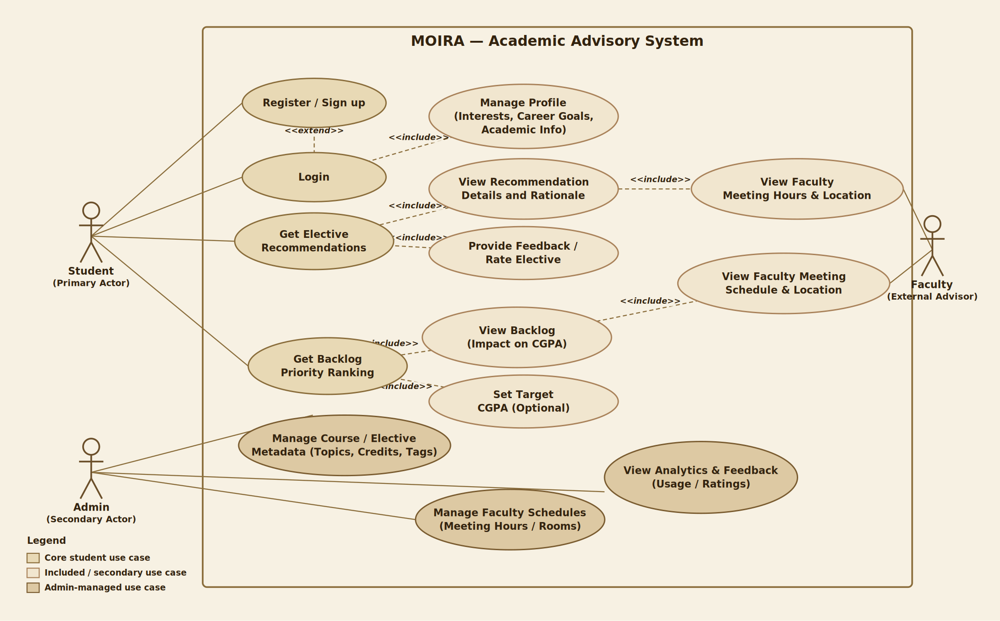

# MOIRA

## Academic Advisory & Decision Support System

> **Every choice draws a path. Find your way forward.**

MOIRA is a web-based academic advisory system that brings together student profiles, academic data, elective recommendation, backlog analysis, and faculty information into a unified decision-support platform for undergraduate students.

The system is designed to provide **personalized, explainable, and transparent academic guidance** while keeping its core decision logic deterministic and reproducible.

---

## Why MOIRA?

The name **MOIRA** is inspired by the **Moirai (Μοῖραι)** of Greek mythology, traditionally associated with fate and the course of a person's life.

The name reflects the central idea behind the system: **academic choices contribute to the path a student takes forward**.

MOIRA does not make decisions on behalf of students. Instead, it brings together their interests, career goals, academic information, and relevant university data to help them evaluate their options and make informed choices.

> **MOIRA — Every choice draws a path. Find your way forward.**

---

## Problem Statement

Students often need to make important academic decisions using information distributed across course-scheme documents, academic records, faculty information, and informal peer guidance.

Two recurring decisions are:

- **Elective Selection:** Which elective best aligns with a student's interests and career direction?
- **Backlog Prioritization:** Which pending backlog should a student consider clearing first based on its potential academic impact?

MOIRA addresses this gap by combining academic data with dedicated advisory and prioritization logic in a single system.

---

# What MOIRA Provides

### Student Profile Management

- [x] Current semester
- [x] CGPA
- [x] Completed credits
- [x] Career goals
- [x] Areas of interest

The profile provides contextual input for the advisory system and is persisted through the backend.

### Elective Advisory

- [x] Structured interests
- [x] Career goals
- [x] Free-text input
- [x] Input normalization
- [x] Rule-based elective scoring
- [x] Ranked recommendations
- [x] Recommendation explanations

### Backlog Advisory

- [x] Pending backlog management
- [x] CGPA-impact estimation
- [x] Priority classification
- [x] Deterministic backlog ranking

> **Note:** Backlog calculations are advisory prototype estimates and are not official university CGPA calculations.

### Faculty Discovery

- [x] Searchable faculty directory
- [x] Faculty specializations
- [x] Faculty contact information where available
- [x] Recommendation-based faculty matching
- [x] Slot booking against real, admin-entered office-hour schedules

Faculty schedule coverage itself remains partial (see *Current Limitations*) — booking only ever operates on `FacultySchedule` rows that actually exist; MOIRA does not fabricate availability to make the feature demoable. A handful of faculty currently have **seeded demo office-hour slots** (`seed_demo_schedules` in `backend/app/seed/seed_data.py`) purely so the booking flow has something real to click through locally — these are clearly-labeled placeholder slots, not real timetable data. The feature will work against the actual faculty base once real office-hour data is collected from each department (the same way `faculty_cse.csv`/`faculty_ece.csv` were sourced from real directories) and entered through the admin Schedules page. See `docs/BOOKING.md`.

### Authentication

- [x] User signup
- [x] User login
- [x] JWT-based authentication
- [x] Bcrypt password hashing
- [x] Protected API resources
- [x] Persistent authenticated sessions
- [x] Role-based authorization (student / admin)

### Admin

- [x] Role-based admin authentication, enforced server-side
- [x] Academic dashboard (courses, faculty, baskets, recent activity)
- [x] Course & elective management (create/edit/delete, search/filter)
- [x] Faculty management (create/edit/delete, search/filter)
- [x] Faculty schedule management (office hours, room, semester)
- [x] Booking visibility (every student's slot bookings, filterable by faculty, with force-cancel)
- [x] Academic configuration (recommendation weights, elective categories)
- [x] Audit logging of admin actions

See `docs/ADMIN.md` for the full architecture and authorization model.

---


# Use Case Diagram

The diagram below summarizes the primary actors and use cases across MOIRA's student, faculty, and admin-facing workflows.



- **Student (Primary Actor):** registers/logs in, manages their profile, requests elective recommendations, and requests backlog priority ranking.
- **Faculty (External Advisor):** consulted for meeting hours, location, and schedule details as part of recommendation and backlog workflows.
- **Admin (Secondary Actor):** manages course/elective metadata and faculty schedules, and views usage/feedback analytics — part of the planned admin extensions described under *Future System Evolution*.

--- 

# System Design

## Architectural Approach

MOIRA follows a **layered client-server architecture** with clear separation between presentation, API handling, application services, decision logic, data access, and persistence.

The architecture is organized around defined responsibilities so that interface concerns, request handling, business logic, and database operations remain decoupled.

```text
┌──────────────────────────────────────────────────────────────┐
│                    PRESENTATION LAYER                        │
│                                                              │
│              React · TypeScript · Tailwind                  │
│              Pages · Components · Context                   │
└─────────────────────────────┬────────────────────────────────┘
                              │
                         HTTP / JSON
                       JWT Bearer Token
                              │
                              ▼
┌──────────────────────────────────────────────────────────────┐
│                         API LAYER                            │
│                                                              │
│                    FastAPI Routes                            │
│             Request Validation · Auth Guards                │
└─────────────────────────────┬────────────────────────────────┘
                              │
                              ▼
┌──────────────────────────────────────────────────────────────┐
│                    APPLICATION LAYER                         │
│                                                              │
│       Profile Services · Elective Services · Backlog        │
│                       Services · Faculty                    │
└─────────────────────────────┬────────────────────────────────┘
                              │
                 ┌────────────┴────────────┐
                 │                         │
                 ▼                         ▼
┌───────────────────────────┐   ┌─────────────────────────────┐
│     DECISION LOGIC        │   │     SUPPORTING LOGIC        │
│                           │   │                             │
│ Elective Recommendation  │   │ Input Normalization         │
│ Backlog Prioritization   │   │ Faculty Matching            │
│ Explanation Generation   │   │ CGPA Estimation             │
└──────────────┬────────────┘   └──────────────┬──────────────┘
               │                               │
               └───────────────┬───────────────┘
                               ▼
┌──────────────────────────────────────────────────────────────┐
│                     DATA ACCESS LAYER                        │
│                                                              │
│                     SQLAlchemy ORM                           │
│               Models · Sessions · Queries                    │
└─────────────────────────────┬────────────────────────────────┘
                              │
                              ▼
┌──────────────────────────────────────────────────────────────┐
│                         DATA LAYER                           │
│                                                              │
│                         PostgreSQL                           │
│                                                              │
│ Students · Profiles · Electives · Backlogs · Faculty         │
└──────────────────────────────────────────────────────────────┘
```

## Architectural Responsibilities

| Layer | Responsibility |
|---|---|
| **Presentation** | Displays application screens and collects student input |
| **API** | Exposes REST endpoints, validates requests, and handles authentication |
| **Application** | Coordinates application use cases |
| **Decision Logic** | Performs elective recommendation and backlog calculations |
| **Data Access** | Provides structured database interaction through SQLAlchemy |
| **Database** | Persists student, academic, elective, backlog, and faculty information |

---

# Core System Modules

## 1. Authentication & Identity

- [x] Account creation
- [x] Login
- [x] Password hashing
- [x] JWT generation and validation
- [x] Current-user resolution
- [x] Protected resources

## 2. Student Profile Module

```text
Student
   │
   └── Profile
        ├── Semester
        ├── CGPA
        ├── Credits
        ├── Career Goal
        └── Interests
```

## 3. Elective Advisory Module

- [x] Student preference processing
- [x] Input normalization
- [x] Interest matching
- [x] Career-goal matching
- [x] Elective scoring
- [x] Ranking
- [x] Explanation generation
- [x] Faculty matching

## 4. Backlog Advisory Module

- [x] Pending backlog storage
- [x] Credit-aware calculation
- [x] CGPA-impact estimation
- [x] Priority assignment
- [x] Deterministic ranking

## 5. Faculty Directory Module

- [x] Faculty retrieval
- [x] Search
- [x] Specialization information
- [x] Contact information
- [x] Recommendation-based matching

## 6. Academic Data Module

- [x] Structured academic datasets
- [x] Seed-data pipeline
- [x] Course metadata loading
- [x] Faculty data loading

---

# End-to-End Data Flow

## Elective Recommendation

```text
Student
   │
   │ Interests + Career Goal + Free Text
   ▼
React Interface
   │
   ▼
Axios API Client
   │
   │ JWT Bearer Token
   ▼
POST /api/electives/recommend
   │
   ▼
FastAPI Route
   │
   ├── Authentication
   └── Request Validation
   │
   ▼
Recommendation Service
   │
   ├── Input Normalization
   ├── Tag Generation
   ├── Elective Scoring
   ├── Ranking
   ├── Explanation Generation
   └── Faculty Matching
   │
   ▼
PostgreSQL
   │
   ▼
Ranked Recommendation Response
   │
   ▼
React Recommendation Interface
```

## Backlog Prioritization

```text
Student Profile
      +
Pending Backlogs
      │
      ▼
Backlog API Request
      │
      ▼
Backlog Service
      │
      ├── Read CGPA
      ├── Read Credit Information
      ├── Estimate Impact
      └── Assign Priority
      │
      ▼
Sorted Backlog Results
      │
      ▼
React Interface
```

---

# Decision Engines

## Elective Recommendation Engine

MOIRA uses a **deterministic, rule-based recommendation approach**.

Student input is normalized into structured interest and career tags. These tags are compared against available elective information to produce a ranked result.

The current scoring model uses:

| Factor | Weight |
|---|---:|
| Interest overlap | 45% |
| Career-goal alignment | 30% |
| Topic overlap | 20% |
| Relevance bonus | Additional |

The ranking remains deterministic and explainable, allowing the same input and academic dataset to produce a reproducible result.

The architecture can later support AI-assisted interpretation of free-text input without making the final ranking dependent on an opaque model.

Detailed logic: [`docs/RECOMMENDATION_LOGIC.md`](docs/RECOMMENDATION_LOGIC.md)

---

## Backlog Prioritization Engine

The backlog engine estimates the potential CGPA change associated with clearing each pending course.

The calculation considers the student's current academic state and course credit information before assigning an estimated impact and priority.

Backlogs are then ordered according to the magnitude of the estimated academic impact.

Detailed logic: [`docs/BACKLOG_LOGIC.md`](docs/BACKLOG_LOGIC.md)

---

# Data Architecture

MOIRA separates persistent database entities from API request and response contracts.

```text
                    ┌────────────────┐
                    │    Student     │
                    └───────┬────────┘
                            │
                            │ 1 : 1
                            ▼
                    ┌────────────────┐
                    │    Profile     │
                    └────────────────┘

Student ────────────────< Backlog

Elective ───────────────< Recommendation Context

Faculty ────────────────< Specialization Matching
```

The ORM layer represents database entities through SQLAlchemy, while Pydantic schemas define API-facing data contracts.

This keeps database representation separate from the external API contract.

---

# Real Academic Data

MOIRA is built around structured academic data rather than fabricated demonstration content.

| Dataset | Current Coverage |
|---|---:|
| Professional Electives | 96 CSE/COE courses |
| CSE Faculty | 211 faculty members |
| ECE Faculty | 65 faculty members |

### Elective Data

The elective dataset covers Professional Elective Baskets I–IV from the 2025 B.E. CSE and COE course-scheme documents.

### Faculty Data

The faculty dataset contains available information such as:

- Name
- Designation
- Specialization
- Email where available
- Office information where available

### Data Integrity

Where source information is unavailable, MOIRA does not fabricate values.

The data-loading pipeline is structured so additional academic sources can be incorporated without changing the core advisory architecture.

---

# Security Architecture

MOIRA protects user-specific API resources through JWT authentication.

```text
Signup / Login
      │
      ▼
Password Verification
      │
      ▼
JWT Issued
      │
      ▼
Authenticated Frontend Session
      │
      ▼
Axios Authorization Header
      │
      ▼
FastAPI Authentication Dependency
      │
      ▼
Protected API Resource
```

### Security Measures

- [x] Bcrypt password hashing
- [x] JWT-based authentication
- [x] Protected FastAPI routes
- [x] Current-user authentication dependency
- [x] Environment-based secrets
- [x] CORS configuration
- [x] Authentication separated from application services

Sensitive configuration such as `DATABASE_URL` and `JWT_SECRET` is supplied through environment variables rather than committed directly to the repository.

---

# API Architecture

MOIRA exposes a REST-based API organized around resources and application use cases.

| Method | Endpoint | Responsibility |
|---|---|---|
| `GET` | `/api/health` | Service health |
| `POST` | `/api/auth/signup` | Account creation |
| `POST` | `/api/auth/login` | Authentication |
| `GET` | `/api/auth/me` | Current user |
| `GET` | `/api/profile` | Retrieve profile |
| `PUT` | `/api/profile` | Update profile |
| `GET` | `/api/electives` | Retrieve electives |
| `GET` | `/api/electives/{id}` | Retrieve elective |
| `POST` | `/api/electives/recommend` | Generate recommendations |
| `GET` | `/api/backlogs` | Retrieve backlogs |
| `POST` | `/api/backlogs` | Add backlog |
| `POST` | `/api/backlogs/prioritize` | Generate priority order |
| `GET` | `/api/faculty` | Search faculty |
| `GET` | `/api/faculty/{id}` | Retrieve faculty |
| `GET` | `/api/bookings` | Retrieve caller's slot bookings |
| `POST` | `/api/bookings` | Book a faculty office-hour slot |
| `DELETE` | `/api/bookings/{id}` | Cancel a booking |

Complete API reference: [`docs/API.md`](docs/API.md)

---

# Tech Stack

| Layer | Technology |
|---|---|
| **Frontend** | React 18, TypeScript, Vite |
| **Styling** | Tailwind CSS |
| **Routing** | React Router |
| **HTTP Client** | Axios |
| **Backend** | Python, FastAPI |
| **ORM** | SQLAlchemy 2 |
| **Validation** | Pydantic 2 |
| **Authentication** | JWT, python-jose |
| **Password Security** | bcrypt |
| **Database** | PostgreSQL |
| **Testing** | pytest, TypeScript build checks |
| **CI/CD** | GitHub Actions (tests, build, Docker image publish to GHCR) |
| **Containerization** | Docker, Docker Compose |
| **Caching** | Redis (optional; targeted read-path caching, see `docs/ARCHITECTURE.md`) |

---

# Project Structure

```text
moira/
│
├── frontend/
│   ├── public/                 Static assets
│   ├── Dockerfile              Multi-stage build → nginx static serve
│   ├── nginx.conf              SPA fallback routing
│   └── src/
│       ├── components/         Reusable UI components
│       ├── pages/              Application screens
│       ├── services/           API client modules
│       ├── context/            Authentication/session state
│       └── utils/              Shared utilities
│
├── backend/
│   ├── Dockerfile
│   ├── app/
│   │   ├── core/               Configuration & security
│   │   ├── database/           Database connection & base
│   │   ├── models/             SQLAlchemy ORM entities
│   │   ├── schemas/            Pydantic API contracts
│   │   ├── routes/             FastAPI endpoints (incl. routes/admin/)
│   │   ├── recommendation/     Recommendation domain logic
│   │   ├── services/           Application/business services
│   │   └── seed/               Academic data loading
│   │
│   ├── tests/                  Backend test suite
│   └── requirements.txt
│
├── docker-compose.yml          Postgres + backend + frontend, local/staging
│
├── docs/
│   ├── ARCHITECTURE.md
│   ├── API.md
│   ├── DATABASE.md
│   ├── ADMIN.md
│   ├── BOOKING.md
│   ├── RECOMMENDATION_LOGIC.md
│   └── BACKLOG_LOGIC.md
│
└── .github/
    └── workflows/
        └── ci.yml
```

---

# Testing & Continuous Integration

MOIRA includes automated backend testing and frontend build verification.

### Backend Tests

- [x] Authentication tests
- [x] Profile operation tests
- [x] Elective recommendation scoring tests
- [x] Recommendation ranking tests
- [x] Backlog prioritization tests
- [x] CGPA-impact calculation tests
- [x] Admin subsystem tests (authorization, CRUD, config, audit logging)
- [x] Slot booking tests (booking, double-booking conflicts, cancellation, ownership)

The current test suite contains **76 backend tests**.

### Continuous Integration

- [x] Backend dependency verification
- [x] Backend test execution
- [x] Frontend installation
- [x] Frontend TypeScript/build validation

GitHub Actions runs automated checks on repository changes.

---

# Setup & Installation

## Option A: Docker Compose (recommended)

Prerequisite: Docker + Docker Compose.

```bash
docker compose up --build
```

This starts PostgreSQL, the backend (`http://localhost:8000`, docs at
`http://localhost:8000/docs`), and the frontend (`http://localhost:5173`).
Seed the demo data once the containers are up:

```bash
docker compose exec backend python -m app.seed.seed_data
```

Prebuilt images from the latest `main` build are also published to GitHub
Container Registry (`ghcr.io/<repo>-backend`, `ghcr.io/<repo>-frontend`) by
CI — see `.github/workflows/ci.yml`.

## Option B: Manual Setup

### Prerequisites

- Python 3.10+
- Node.js 18+
- PostgreSQL 14+

### 1. Create the Database

```sql
CREATE USER moira_user WITH PASSWORD 'moira_password';
CREATE DATABASE moira OWNER moira_user;
```

### 2. Configure the Backend

```bash
cd backend
python -m venv .venv
```

### Windows Git Bash

```bash
source .venv/Scripts/activate
```

### Windows PowerShell

```powershell
.venv\Scripts\Activate.ps1
```

Install dependencies:

```bash
pip install -r requirements.txt
```

Create the environment file:

```bash
cp .env.example .env
```

Configure:

```text
DATABASE_URL
JWT_SECRET
REDIS_URL   # optional — caching degrades gracefully to direct DB reads if unset/unreachable
```

### 3. Seed Academic Data

```bash
python -m app.seed.seed_data
```

### 4. Start the Backend

```bash
uvicorn app.main:app --reload --port 8000
```

Backend:

```text
http://localhost:8000
```

API documentation:

```text
http://localhost:8000/docs
```

### 5. Configure the Frontend

```bash
cd frontend
npm install
```

Create `.env`:

```bash
cp .env.example .env
```

Set:

```env
VITE_API_URL=http://localhost:8000/api
```

### 6. Start the Frontend

```bash
npm run dev
```

Frontend:

```text
http://localhost:5173
```

### 7. Demo Account

```text
Email:    alex.chen@thapar.edu
Password: Demo@1234
```

The seeded account contains a profile, interests, and sample backlogs for testing the primary workflows.

---

# Documentation

The `docs/` directory contains detailed technical documentation.

| Document | Description |
|---|---|
| [`ARCHITECTURE.md`](docs/ARCHITECTURE.md) | System architecture and testing strategy |
| [`API.md`](docs/API.md) | REST API reference |
| [`DATABASE.md`](docs/DATABASE.md) | Database schema |
| [`RECOMMENDATION_LOGIC.md`](docs/RECOMMENDATION_LOGIC.md) | Elective recommendation logic |
| [`BACKLOG_LOGIC.md`](docs/BACKLOG_LOGIC.md) | Backlog prioritization and CGPA estimation |
| [`ADMIN.md`](docs/ADMIN.md) | Admin subsystem: authorization model, data model, workflows |
| [`BOOKING.md`](docs/BOOKING.md) | Slot booking against real faculty office-hour schedules |

---

# Future System Evolution

The current architecture establishes modular boundaries that can support additional functionality and larger deployments.

### Access & Administration

- [x] Role-Based Access Control for Student and Admin
- [x] Admin dashboard
- [x] Academic course and elective management
- [x] Faculty data management
- [x] Faculty schedule management
- [x] Slot booking against real faculty schedules
- [x] Academic rule/configuration management
- [x] Audit logging

### Performance & Processing

- [x] Redis caching for the read-heavy `/api/electives` and `/api/faculty` listings
- [ ] Caching of suitable repeated recommendation requests
- [ ] Background workers for asynchronous processing
- [ ] Job-based processing for heavier workloads

### Reliability & Observability

- [ ] Centralized structured logging
- [ ] Application metrics
- [ ] Health monitoring
- [ ] Error tracking
- [ ] API rate limiting
- [ ] Request tracing
- [ ] Expanded failure handling

### Deployment & Infrastructure

- [x] Docker-based environments (`docker-compose.yml`, per-service Dockerfiles)
- [x] Automated image build + publish to GHCR on merge to main (CI)
- [ ] Cloud deployment
- [ ] Managed PostgreSQL
- [ ] Load balancing
- [ ] Horizontal backend scaling

### Architectural Scaling

As usage grows, individual domain boundaries can be deployed independently where justified.

```text
                         API Gateway
                              │
             ┌────────────────┼────────────────┐
             │                │                │
             ▼                ▼                ▼
      Authentication     Academic Data     Advisory
         Service            Service         Service
             │                │                │
             └────────────────┼────────────────┘
                              │
                              ▼
                     Shared Infrastructure
```

The objective is to introduce additional infrastructure when supported by actual system requirements, rather than adding architectural complexity without a corresponding need.

---

# Current Limitations

- Current elective coverage is CSE + COE.
- Current faculty coverage is CSE + ECE.
- Mechanical, Civil, and ENC datasets are not currently included.
- CSE faculty office-hours data is not currently available.
- Slot booking currently runs against a small set of **seeded demo office-hour slots** for a handful of faculty, not real timetable data — real per-professor availability has not been collected yet. Once each department supplies real office-hour data (the same way the faculty directories themselves were sourced), an admin enters it through the Schedules page and booking works against it exactly the same way, with no code changes needed.
- Elective information is currently limited to scheme-level information such as course code, title, and credits rather than complete syllabus and prerequisite information.
- Faculty recommendations are based on specialization/topic matching rather than fixed instructor assignments.
- Backlog CGPA impact uses a documented prototype calculation and should not be treated as an official university calculation.
- MOIRA is not connected to a university enrollment system.
- Production deployment infrastructure is part of future system evolution.

---

# Project Status

## Core System

The current implementation covers the primary student-facing academic-advisory workflow.

### Implemented

- [x] JWT authentication
- [x] Role-Based Access Control (student / admin, enforced server-side)
- [x] Student profile management
- [x] Elective discovery
- [x] Rule-based elective recommendation
- [x] Explainable recommendation results
- [x] Backlog management
- [x] CGPA-impact estimation
- [x] Backlog prioritization
- [x] Faculty directory
- [x] Faculty specialization matching
- [x] Faculty schedule management (admin CRUD)
- [x] Slot booking against real faculty schedules
- [x] Admin management interface (electives, faculty, schedules, config)
- [x] Academic rule/configuration management (recommendation weights, elective categories)
- [x] Audit logging of admin actions
- [x] Real academic data pipeline
- [x] REST API
- [x] PostgreSQL persistence
- [x] Backend automated tests
- [x] GitHub Actions CI
- [x] Docker containerization + CI image publish to GHCR
- [x] Redis caching for read-heavy listing endpoints

### Planned Extensions

- [ ] Background processing
- [ ] Observability and monitoring
- [ ] Cloud deployment
- [ ] Horizontal scaling
- [ ] Independent service deployment where justified

---

# System Scope

```text
                         MOIRA
                           │
          ┌────────────────┼────────────────┐
          │                │                │
          ▼                ▼                ▼
     Student Profile   Academic Data   Faculty Data
          │                │                │
          └────────────────┼────────────────┘
                           │
              ┌────────────┴────────────┐
              │                         │
              ▼                         ▼
      Elective Advisory        Backlog Advisory
              │                         │
              ▼                         ▼
      Ranked & Explained         CGPA Impact &
       Recommendations          Priority Ranking
              │                         │
              └────────────┬────────────┘
                           ▼
                   Student Decision Support
```

---

# Validation Plan

The system is intended to be evaluated beyond functional correctness.

### Performance

- [ ] Measure Time-to-Recommendation from submission to rendered result
- [ ] Target median recommendation time below 30 seconds

### User Acceptance

- [ ] Pilot with 15–25 students
- [ ] Collect feedback on clarity
- [ ] Collect feedback on usefulness
- [ ] Collect feedback on perceived responsiveness

---

# License

Educational project developed as part of a Software Engineering Lab project.

<p align="center">
  <strong>MOIRA</strong><br>
  Academic decision support for undergraduate students.
</p>
