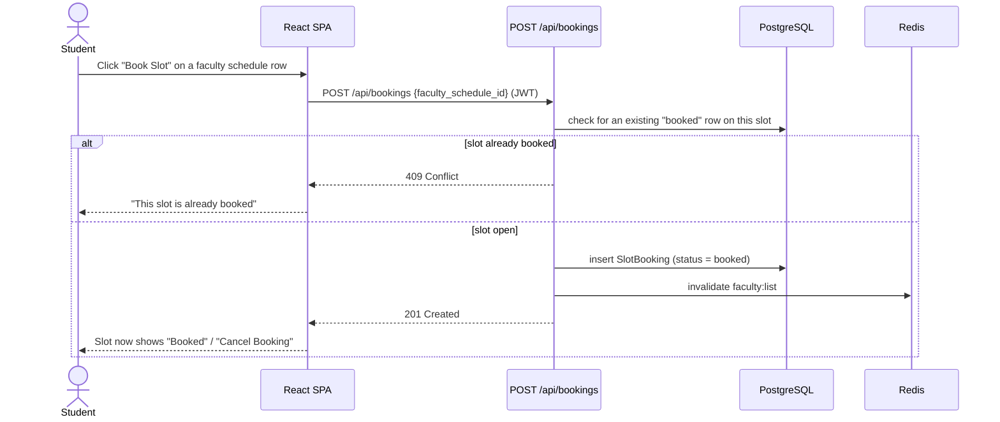

# Slot Booking

A student-facing feature layered on top of the existing `FacultySchedule`
data: a student can reserve one of a faculty member's real, admin-entered
office-hour slots. Full endpoint reference: `docs/API.md`. Schema:
`docs/DATABASE.md`.

## Why this design

`FacultySchedule` rows already represent real, admin-entered availability
(see `docs/ADMIN.md`) — for most CSE faculty, no schedule data exists yet at
all (see the "Current Limitations" section of the README). Rather than
inventing placeholder availability to make a booking feature demoable, the
booking layer only ever operates on `FacultySchedule` rows that already
exist. A slot with no real data simply has nothing to book; that is correct
behavior, not a gap. This keeps booking consistent with the rest of the
project's data-integrity stance: MOIRA does not fabricate values.

## Current status: demo data only

`seed_demo_schedules()` in `backend/app/seed/seed_data.py` seeds a small,
clearly-labeled set of placeholder office-hour slots (1–3 slots each) for a
handful of faculty, purely so the booking flow has something real to click
through locally and in a pitch demo. **These are not real timetable data** —
unlike `faculty_cse.csv`/`faculty_ece.csv` (sourced from actual department
directories), no real per-professor office-hour schedule has been collected
yet for most departments (see the README's "Current Limitations"). Once a
department supplies that data, an admin enters it through the Schedules page
(`/admin/schedules`) exactly like any other `FacultySchedule` row, and
booking works against it identically — no code changes required, since the
booking layer only ever reads whatever `FacultySchedule` rows exist.

## Data model

One new table, **`slot_bookings`**:

| Column | Type | Notes |
|---|---|---|
| id | PK | |
| student_id | FK → users.id | who booked the slot |
| faculty_schedule_id | FK → faculty_schedules.id | which slot |
| status | string | `"booked"` \| `"cancelled"` |
| created_at | datetime | |

A cancelled row is kept, not deleted, so a slot's booking history stays
auditable. Only a `"booked"` row blocks the slot for other students — at
most one `"booked"` row can exist per `faculty_schedule_id` at a time,
enforced in `routes/bookings.py` at request time (the same
query-before-insert pattern used for `ref_code`/`(code, department)`
uniqueness elsewhere in the codebase, rather than a database-level
constraint).

`FacultySchedule` gained a computed `is_booked` property (`any(b.status ==
"booked" for b in self.bookings)`) — not a stored column, so it can never go
stale relative to the actual booking rows. It's surfaced on `ScheduleOut`
(used by `GET /api/faculty` and nested inside `GET /api/admin/bookings`), so
the public faculty directory always reflects live booking state.
`AdminScheduleOut` (the admin Schedules CRUD page) does not include it —
admin-side booking visibility is the dedicated Bookings page below, not the
Schedules page.

## Request Flow

<strong>View diagram</strong>

## Endpoints

All require `Authorization: Bearer <token>` for any authenticated user
(student or admin) — there's no admin-only step here, booking is a student
action.

| Method | Endpoint | Behavior |
|---|---|---|
| `GET` | `/api/bookings` | The caller's own active (`status="booked"`) bookings, each with the nested `schedule` |
| `POST` | `/api/bookings` | Body `{ "faculty_schedule_id": <id> }` → `201` created booking. `404` if the slot doesn't exist, `409` if it's already booked (by anyone) |
| `DELETE` | `/api/bookings/{id}` | Cancels the caller's own booking (sets `status="cancelled"`) → `204`. `404` if it doesn't exist or belongs to someone else |

Admin-only visibility and override, distinct from the student-facing
endpoints above (full reference: `docs/API.md#admin`):

| Method | Endpoint | Behavior |
|---|---|---|
| `GET` | `/api/admin/bookings` | Every booking (active and cancelled), any student — the student-facing `GET /api/bookings` only ever shows the caller's own. Optional `faculty_id` filter. |
| `DELETE` | `/api/admin/bookings/{id}` | Force-cancels any student's booking (e.g. a professor cancels office hours). Recorded in the audit log like any other admin mutation. |

`GET /api/admin/dashboard` also reports `total_active_bookings`.

## Frontend

**Student side:** no dedicated page — booking is exposed inline wherever a
faculty schedule is already shown: `components/faculty/ScheduleSlotRow.tsx`
replaces the old plain `<li>` schedule line in both `FacultyCard` (the
faculty directory, `/faculty`) and `FacultyMiniCard` (the "faculty working
in this area" panel attached to each elective recommendation). Each row
independently shows "Book Slot", a disabled "Booked" label (someone else has
it), or "Cancel Booking" (the current student has it) — determined by
cross-referencing the slot's `is_booked` flag against the student's own
`GET /api/bookings` list.

**Admin side:** `/admin/bookings` (`AdminBookingsPage.tsx`, linked from the
admin nav and the dashboard) lists every active booking with the student's
name/email, the faculty and slot, and a cancel action; a collapsed section
below shows cancelled history. The dashboard's stat tiles also surface a
live `total_active_bookings` count.

## Testing

`backend/tests/test_bookings.py` covers: booking an open slot; booking
requires auth; booking an unknown slot returns `404`; double-booking the
same slot returns `409`; cancelling frees the slot for another student;
cancelling someone else's booking returns `404`; `GET /api/faculty` reflects
booked state live; admin can see and filter all bookings by faculty; a
student cannot access the admin bookings endpoints (`403`/`401`); and an
admin force-cancel frees the slot the same way a self-cancel does.
