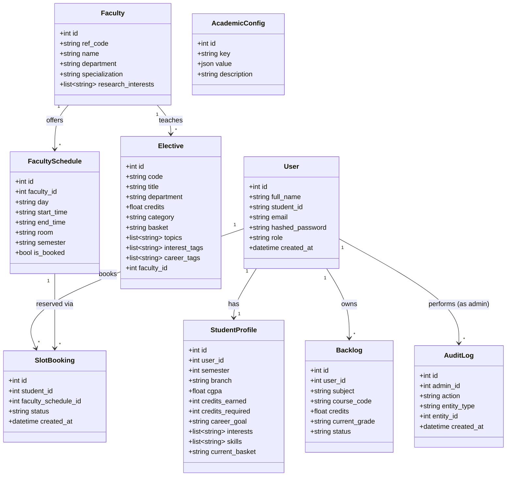

# Database Schema

PostgreSQL via SQLAlchemy ORM. Tables are created automatically on backend
startup via `Base.metadata.create_all()` — no migration tool (Alembic) is
used yet to keep the project simple; add Alembic if the schema needs to
evolve against a populated production database later.

`create_all()` is additive-only (it never alters an existing table), so the
two columns added for the Admin feature (`users.role`,
`faculty_schedules.semester`) are backfilled onto an already-populated
Postgres database by a small idempotent guard in `main.py`
(`_upgrade_existing_schema`, `ALTER TABLE ... ADD COLUMN IF NOT EXISTS`,
gated to the `postgresql` dialect) that runs once at startup before
`create_all()`. No existing data is touched or lost; new columns get safe
defaults (`role` → `'student'`, `semester` → `''`).

## Class Diagram

<details open>
<summary><strong>View diagram</strong></summary>



</details>

## Entities

### `users`
| Column | Type | Notes |
|---|---|---|
| id | PK | |
| full_name | string | |
| student_id | string | unique |
| email | string | unique |
| hashed_password | string | bcrypt hash, never plaintext |
| role | string | `"student"` (default) or `"admin"`; never self-settable via signup — see `docs/ADMIN.md` |
| created_at | datetime | |

### `student_profiles` (1:1 with `users`)
| Column | Type | Notes |
|---|---|---|
| id | PK | |
| user_id | FK → users.id | unique |
| semester | int | |
| branch | string | |
| cgpa | float | 0–10 scale |
| credits_earned | int | |
| credits_required | int | degree total, default 160 |
| career_goal | string | free text, also tag-normalized |
| interests | JSON list[str] | canonical interest tags |
| raw_intent_text | string | last free-text intent submitted |

### `faculty`
| Column | Type | Notes |
|---|---|---|
| id | PK | |
| ref_code | string | unique short code (e.g. `ECE-KBS`, `CSE-042`) |
| name, title, department | string | |
| specialization | string | |
| research_interests | JSON list[str] | `specialization` split on commas |
| office_location | string | room number where the source data has it (e.g. ECE); empty otherwise |
| email, photo_url, profile_url | string | from the source faculty directory; empty if unavailable |

### `faculty_schedules` (N:1 with `faculty`)
| Column | Type | Notes |
|---|---|---|
| id | PK | |
| faculty_id | FK → faculty.id | |
| day | string | e.g. `Monday` |
| start_time, end_time | string | `HH:MM` |
| room | string | |
| note | string | e.g. `Office Hours` |
| semester | string | e.g. `"Odd 2026-27"`; empty = standing/every-semester slot. Admin-entered only, never inferred — see `docs/ADMIN.md` |

### `electives`
| Column | Type | Notes |
|---|---|---|
| id | PK | |
| code | string | e.g. `UCS531` — **unique per (code, department)**, not globally unique, since the same course code is legitimately offered under multiple branches |
| title, department, description | string | `description` empty (not in source scheme summary tables) |
| credits | float | |
| prerequisites | string | empty (not in source scheme summary tables) |
| category | string | e.g. `Professional Elective` |
| topics | JSON list[str] | auto-derived from `title` via the recommendation engine's keyword vocabulary |
| interest_tags | JSON list[str] | same derivation as `topics`, used by recommendation engine |
| career_tags | JSON list[str] | auto-derived from `title`; often empty since course titles rarely contain career-goal phrasing |
| faculty_id | FK → faculty.id | always null for seeded data — the source scheme documents don't assign a fixed instructor per elective section (see `suggest_faculty` in `docs/RECOMMENDATION_LOGIC.md`) |

### `backlogs` (N:1 with `users`)
| Column | Type | Notes |
|---|---|---|
| id | PK | |
| user_id | FK → users.id | |
| subject, course_code | string | |
| credits | float | |
| course_type | string | e.g. `Core Course` |
| current_grade | string | last attempted grade, informational |
| status | string | `pending` \| `cleared` |
| created_at | datetime | |

### `audit_log`
| Column | Type | Notes |
|---|---|---|
| id | PK | |
| admin_id | FK → users.id, nullable | who performed the action |
| action | string | `"create"` \| `"update"` \| `"delete"` |
| entity_type | string | e.g. `"elective"`, `"faculty"`, `"faculty_schedule"`, `"academic_config"`, `"slot_booking"` (admin force-cancel only — a student's own cancel is not an admin action) |
| entity_id | int, nullable | |
| details | JSON, nullable | small free-form context, e.g. `{"code": "UCS900"}` or `{"fields": ["title"]}` |
| created_at | datetime | indexed, written by every admin mutation — see `docs/ADMIN.md` |

### `slot_bookings` (N:1 with `users` and `faculty_schedules`)
| Column | Type | Notes |
|---|---|---|
| id | PK | |
| student_id | FK → users.id | who booked the slot |
| faculty_schedule_id | FK → faculty_schedules.id | which slot |
| status | string | `booked` \| `cancelled` |
| created_at | datetime | |

At most one `"booked"` row can exist per `faculty_schedule_id` at a time,
enforced at request time in `routes/bookings.py` rather than a database
constraint (same pattern as the `ref_code`/`(code, department)` uniqueness
checks elsewhere). A cancelled row is kept, not deleted, so booking history
stays auditable. See `docs/BOOKING.md`.

### `academic_config`
| Column | Type | Notes |
|---|---|---|
| id | PK | |
| key | string | unique, e.g. `"recommendation_weights"`, `"elective_categories"` |
| value | JSON | shape depends on `key` |
| description | string | |
| updated_at | datetime | |
| updated_by | FK → users.id, nullable | |

Generic key/value store rather than one column per setting, so new
admin-configurable rules can be added without a schema change. Only
`recommendation_weights` currently feeds into engine behavior (see
`docs/ADMIN.md`); other keys are stored for the admin UI to read/display.

## Relationships

```
User 1───1 StudentProfile
User 1───N Backlog
User 1───N AuditLog        (as the acting admin)
Faculty 1───N FacultySchedule
Faculty 1───N Elective
User 1───N SlotBooking
FacultySchedule 1───N SlotBooking
```

## Seed data

`backend/app/seed/seed_data.py` loads real data from
`backend/app/seed/data/`:

- `faculty_cse.csv` (211 rows) and `faculty_ece.csv` (65 rows) — real
  Thapar CSED/ECED faculty directories.
- `electives_cse.csv` and `electives_coe.csv` (48 rows each) — real
  Professional Elective baskets transcribed from the official 2025 B.E.
  CSE/COE course scheme documents.

It also seeds a handful of **demo office-hour slots** (`seed_demo_schedules`
— 1–3 `FacultySchedule` rows each for six faculty) purely so the Slot
Booking feature (`docs/BOOKING.md`) has something real to click through
locally; these are clearly-labeled placeholders, not real timetable data.

It also seeds one **demo student account**
(`alex.chen@thapar.edu` / `Demo@1234`) with a sample profile and 3 pending
backlogs, clearly a demo account (not sourced from any real record), so the
app can be tried immediately without signing up, plus one **dev admin
account** (`admin@moira.app` / `AdminPass123!`, `role="admin"` — rotate or
remove before any real deployment, see `docs/ADMIN.md`) and the initial
`academic_config` rows (`recommendation_weights`, `elective_categories`).
Mechanical, Civil, and ENC branch data is not yet included — add a CSV + a
`FACULTY_SOURCES`/`ELECTIVE_SOURCES` entry the same way to extend coverage.
