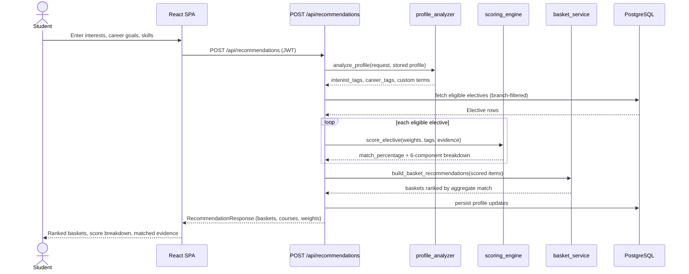

# Elective Recommendation Logic

MOIRA's Elective Advisor is a **deterministic, rule-based, fully auditable**
recommendation engine: every score a student sees can be traced back to a
documented formula and the specific evidence that produced it — the same
input and the same academic dataset always reproduce the same result. This
document is the source of truth for that formula; the implementation lives
in `backend/app/recommendation/`.

## Request Flow

<strong>View diagram</strong>

## 1. Recommending by basket, not by course

The source Elective Focus Basket (EFB) documents group every Elective I–IV
sequence under a named basket (e.g. *"Data Science"*, *"DevOps and
Continuous Delivery"*). A student commits to **one basket** and takes all
four electives from within it, so the basket — not an individual course —
is the primary recommendation unit. `basket_service.build_basket_recommendations`
aggregates each member course's own score into a basket-level average and
ranks baskets by that average.

- `GET`-equivalent behavior: available baskets are computed before any
  slot/basket-lock filtering, so a student can always see what they *could*
  commit to, even once results are narrowed to a basket they've already
  chosen.
- **Basket lock:** once `StudentProfile.current_basket` is set, subsequent
  recommendations for the remaining Elective II–IV slots are constrained to
  that basket. Open/generic electives are a university-wide category and
  are exempt from the lock.
- **Branch-aware filtering:** results are limited to the student's own
  branch plus open/generic electives — unless no branch is on file yet, in
  which case the response includes an explicit `branch_warning` rather than
  silently blending every department's catalogue together.

## 2. Free text and chips → structured signal

A student's stated interests, career goals, skills, and free-text intent
are normalized into a fixed vocabulary of canonical tags via keyword
matching (`INTEREST_KEYWORDS` / `CAREER_KEYWORDS`) — case-insensitive,
substring-based, and fully reproducible for the same input text, with no
inference step in between.

Interest or domain text that doesn't resolve to a canonical tag isn't
discarded: it's carried forward as a **custom interest term** and matched
literally against a course's own title/description/syllabus text, so a
student typing something specific (e.g. *"Sustainable Computing"*) still
gets credit if a course genuinely covers it, rather than the chip silently
doing nothing.

## 3. Scoring a course (0–100)

Every course is scored as the sum of six independently-computed, weighted
components — each a ratio between something the student stated and
something actually present on the `Elective` record:

| Component | Default Weight | What it measures |
|---|---:|---|
| Interest Alignment | 25 | Overlap between the student's interest tags and the course's tagged interests, plus literal matches for custom interest terms |
| Career Goal Alignment | 25 | Overlap between the student's career-goal tags and the course's career tags (proportional, not all-or-nothing) |
| Syllabus Alignment | 20 | Real evidence from the course's actual unit-by-unit syllabus outline, with a floor when the course is tagged-relevant but its literal unit headers don't spell it out |
| Skill Alignment | 15 | Literal skill keywords the student typed, matched against the course's title/description/syllabus text |
| Academic Fit | 10 | Whether the course sits in the elective slot being filled this term, plus overlap between completed coursework and the course's stated prerequisites/description |
| Prerequisite Compatibility | 5 | Whether the student has completed what the course's own "Recommended Prerequisites" line actually asks for |

Each ratio is clamped to `[0, 1]` before being multiplied by its weight, so
no component can ever push the total past its own maximum, and the six
components can never sum past 100. Weights are configurable in one place
(`SCORE_WEIGHTS` in `scoring_engine.py`) and, since **§5**, by an admin at
runtime — the formula itself never changes, only how much each factor
counts.

### 3.1 Why a flat floor for Syllabus Alignment

An earlier ratio-only design divided by a course's *own* topic count, which
rewarded thin tagging: a narrowly-tagged course could hit a "perfect" ratio
trivially, while a richly-tagged course covering *more* genuine ground
scored lower for the identical match, purely for having a larger
denominator. A flat floor (applied when a course is tag-relevant at all)
removes that bias, while real syllabus-line evidence — when it clears the
floor — still earns credit above it. Finding some evidence is never scored
worse than finding none.

## 4. Ranking and explanation

All eligible courses are scored and sorted by `match_percentage`, with ties
broken by the total amount of genuine matched evidence (interests + career
tags + skills + syllabus lines) — so a course backed by real, specific
signal is never buried behind several tied on a bare floor score with no
evidence at all. Each result carries:

- ✅ A full score breakdown (all six components, earned vs. maximum)
- ✅ The specific matched interests, career tags, skills, and syllabus lines behind the score
- ✅ A per-prerequisite satisfied/not-satisfied checklist
- ✅ A generated, human-readable explanation built from what actually matched

## 5. Admin-tunable, engine-owned

An admin can retune the six weights (`PUT /api/admin/config/recommendation_weights`,
values must be integers summing to 100) without touching scoring logic
itself — the admin only ever supplies numbers into the existing, unchanged
formula above; `score_elective()` still owns all scoring and ranking
behavior. See `docs/ADMIN.md` for the full "admin manages data → engine
consumes it" flow.

## 6. Why rule-based

Every score must be traceable to a specific, auditable rule that a student
can trust and a faculty reviewer can check — a requirement a general
language model can't guarantee, since its reasoning isn't reproducible or
independently verifiable from the same input twice. Keyword-based tag
extraction was chosen deliberately over a learned or generative
interpretation step for the same reason: it keeps every recommendation
provably reproducible end to end. The architecture keeps this scoring layer
and the input-interpretation layer separate, so a more sophisticated
interpretation step could be introduced later without changing what
produces the final ranking.
